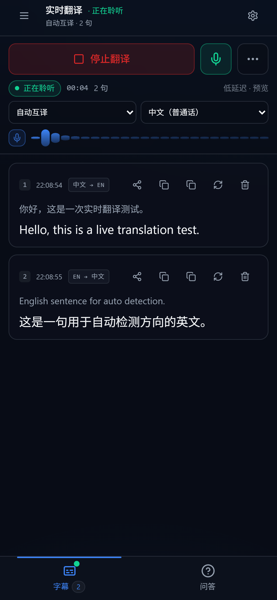
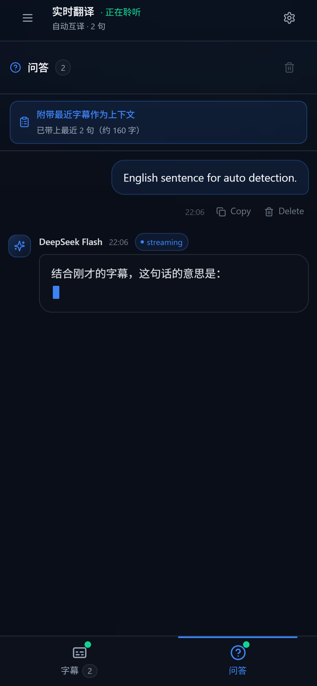
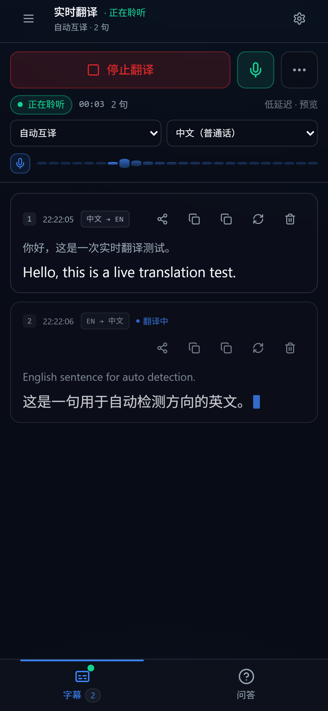
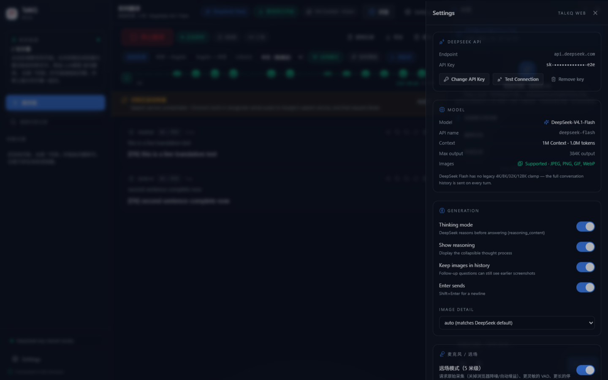

# TalkQ

**100% 浏览器端的实时语音翻译 + DeepSeek 对话客户端。**
把 NexQ 的前端 UI/UX 保留下来，去掉全部桌面后端：没有 Tauri、没有 Rust、没有 Node 服务、没有 API Proxy、没有数据库。构建产物 `dist/` 是纯静态文件，直接丢到 GitHub Pages 就能用。

### 🚀 线上地址：**https://nakanonino455.github.io/TalkQ-web/**

[](https://github.com/NakanoNino455/TalkQ-web/actions/workflows/deploy.yml)


<details>
<summary>手机端截图（底部标签：字幕 / 问答 / 底部操作面板）</summary>





</details>

<details>
<summary>首次使用截图（API Key Modal）</summary>


</details>

两个区域（同一个界面，不再是两个模式）：

| 区域 | 做什么 |
| --- | --- |
| **实时翻译**（主区域） | 点「开始实时翻译」→ 浏览器请求麦克风权限 → 边说边出**双语字幕**（原文 + DeepSeek Flash 译文，逐句流式） |
| **问答**（右侧栏） | 直接粘贴问题问 DeepSeek；开启「附带最近字幕」后，回答会结合你刚听到的内容。支持图片、Markdown、代码复制、Regenerate |

```
GitHub Pages → 浏览器打开网页 → 输入一次 DeepSeek API Key（存 localStorage）
             → 点开始实时翻译（允许麦克风）→ 边说边出双语字幕
             → 右侧问答栏粘贴问题 → 结合刚才的字幕给出答案
```

---

## 1. 快速开始

```bash
npm install
npm run dev      # 自动打开浏览器 → http://localhost:5173/TalkQ-web/
npm run build    # 产出 dist/（GitHub Pages 用）
npm run preview  # 本地预览 dist/
```

要求：Node.js 18+（开发用 20/22/24 均验证通过）。**不需要**安装任何桌面程序、Rust 工具链或后台服务。

### ⚠️ 不要直接双击 `index.html`

这是 Vite 的 ES Module 应用，浏览器在 `file://` 协议下会拒绝加载外部模块，双击只会看到一片空白：

```
Access to script at 'file:///C:/TalkQ-web/assets/index-xxx.js' from origin 'null'
has been blocked by CORS policy
```

三种正确打开方式：

| 方式 | 命令 / 操作 | 说明 |
| --- | --- | --- |
| **开发模式（推荐）** | `npm install` → `npm run dev` | 会自动打开浏览器；改代码即时热更新 |
| **本地预览产物** | `npm run build` → `npm run preview` | 跑真实 `dist/` 产物 |
| **单文件版（免安装、可双击）** | `npm run build:standalone` → 双击 `dist-standalone/talkq.html` | 一个 755KB 的自包含 HTML（图标已内联），CSS/JS/图标全部内联，双击即用，也可以直接发给别人 |

> 单文件版同样只访问 `https://api.deepseek.com`，Key 存在该页面的 localStorage 里。它只是额外的便利产物；`dist/` 仍是部署 GitHub Pages 的标准产物。

### 应用图标

图标是从一张源图生成的（默认 `C:\Users\Administrator\Pictures\general-profile-picture.jpg`，可传路径覆盖）：

```bash
npm run icons                          # 用默认源图
npm run icons "D:\pics\my-avatar.png"  # 或指定任意图片
```

生成到 `public/`：

| 文件 | 用途 |
| --- | --- |
| `favicon.ico` | 浏览器标签页（内含 16 / 32 / 48 三档，PNG 压缩） |
| `favicon-32.png` | 高清屏标签页 |
| `apple-touch-icon.png` | iOS「添加到主屏幕」（180×180） |
| `icon-192.png` / `icon-512.png` | Android / PWA 图标，`site.webmanifest` 里引用 |
| `site.webmanifest` | 让「添加到主屏幕」后以独立应用方式打开（深色、无浏览器工具栏） |

> 小尺寸（16–48px）用的是**面部特写裁剪 + 圆角**，不是整张原图——全身插画缩到 32px 会糊成一团，只有脸部还能认出。裁剪比例在 `scripts/generate-icons.mjs` 顶部的 `FACE_CROP`，换图后如果构图不同可以调。

---

## 2. 它是什么 / 不是什么

| 保留（NexQ 前端资产） | 移除（NexQ 桌面部分） |
| --- | --- |
| 深色 slate 主题、HSL 设计令牌、`0.625rem` 圆角 | `src-tauri/`、Rust 后端、`@tauri-apps/*` 依赖 |
| 侧栏 / 对话区 / 输入区 / Settings 抽屉布局 | Tauri commands、IPC、`cpal`、WASAPI、原生麦克风采集 |
| 半透明毛玻璃、柔和辉光、5px 滚动条 | 桌面窗口 API、always-on-top、桌面悬浮层 overlay |
| 弹簧入场动画、Toast、流式 caret、shimmer | 系统托盘、原生通知、全局快捷键、原生截图 |
| Chat UI、Message Card、Markdown、代码块复制 | 原生文件系统 / 对话框 / Store / Updater 插件 |

`package.json` 里已经**没有**任何 `@tauri-apps/*`，项目里也**没有** `src-tauri/`。
`npm run dev` / `npm run build` 不会因为没有 Tauri 而报错。

---

## 3. 实时翻译（Live Translate）

### 怎么用

1. 打开页面（首次需先填一次 DeepSeek API Key）
2. 左侧切到 **实时翻译**，点 **开始实时翻译**（或空状态里的大麦克风）
3. 浏览器弹出**麦克风权限**请求 → 选「允许」
4. 开始说话：识别中的文字实时显示（灰色斜体），稳定后立刻流式给出**预览译文**
5. 一句话说完 → 变成一条**双语字幕**（上：原文，下：译文，右侧显示语向与耗时）
6. 可随时 **停止翻译**（释放麦克风）、**复制全部**、**导出 .txt**、**清空**
7. 每条字幕右侧有 4 个按钮：

   | 按钮 | 作用 |
   | --- | --- |
   | <kbd>分享</kbd> | 把这条字幕的**英文**（英文原文，或译文是英文时取译文）自动填进右侧问答框**并立即发送**，模型会结合刚刚的字幕作答 |
   | <kbd>复制英文</kbd> | 只复制英文那半句（若这条没有英文则显示「复制原文」） |
   | <kbd>复制译文</kbd> | 复制译文 |
   | <kbd>重译</kbd> / <kbd>删除</kbd> | 单独重译这条，或删掉它 |

### 问答栏（就在实时翻译里面）

不用切换模式，问答栏一直贴在右侧（窄屏会变成抽屉，`Ctrl/Cmd + Shift + K` 可收起/展开）：

* **粘贴即问**：把任何文字粘进输入框，回车发送，答案流式出现
* **上传文档**：输入框左边的回形针按钮支持 **PDF / TXT / DOCX**，解析出的文字会随提问一起发给模型：
  * TXT 自动处理 UTF-8 / GBK 编码（Windows 中文记事本存的文件也能读）
  * DOCX 在浏览器里解压 `word/document.xml`（用的是浏览器自带的 `DecompressionStream`，不需要额外库）
  * PDF 用 **按需加载的 pdf.js** 解析（首次上传 PDF 时才下载约 480KB 的解析器 + worker，不影响首屏）
  * 文档会一直挂在输入框上方，**每次提问都会带上**（方便连续追问同一个文件），点 `×` 即可移除；刷新后仍在（超过约 1.5MB 的文本只留在内存里）
  * 上限：单文件 20MB / 单文档 12 万字 / 一次最多 5 个（超出会截断并提示）
  * 扫描版（图片型）PDF 没有可提取文字，会明确告诉你改用截图提问
* **附带最近字幕作为上下文**（默认开）：提问时自动带上最近 12 句字幕，所以可以直接问
  「刚才那句话什么意思」「帮我把这段总结成 3 点」「这份 PDF 的结论是什么」
* 上下文与文档**只影响这一次请求**，不会混进你看到的对话记录里；每轮都会带上最新的字幕与文档
* 关掉字幕开关，它就是一个普通的多轮对话（同样支持图片、Markdown、代码块复制、Regenerate）
* 左侧栏「问答记录」保存历史会话，只存在本机浏览器

### 架构（为什么必须这样）

```
麦克风 ──▶ 浏览器内置语音识别（Web Speech API）──▶ 文字
                                                  │
                                                  ▼
                                   DeepSeek Flash 流式翻译（chat/completions）
                                                  │
                                                  ▼
                                        双语字幕（逐句流式渲染）
```

**DeepSeek 没有语音识别（ASR）接口** —— 官方 API 只接受文本与图片，不接受音频。
所以语音转文字必须由浏览器完成，DeepSeek 只负责把文字翻译好。

### 可切换的设置（界面顶部 + Settings → 实时翻译）

| 设置 | 说明 |
| --- | --- |
| 翻译方向 | **自动互译**（按每句话的语言自动决定中→英 / 英→中）/ 固定 中→英 / 固定 英→中 |
| 识别语言 | 中文（普通话）/ English (US) / 日本語 / 한국어（固定方向时自动跟随方向） |
| 实时预览 | 说话过程中就先流式给出预览译文（默认开） |
| 低延迟 | 翻译时关闭 DeepSeek 思考模式，首字更快（默认开） |
| 保留翻译记录 | 字幕存 `localStorage`，刷新后仍在（默认开） |

单句翻译带**上下文**：会把最近 4 组「原文 → 译文」一起发给模型，让人名、术语、代词保持一致。
翻译队列**严格串行**，一次只发一个请求，避免连续说话时触发限流或字幕乱序。
Chrome 会在停顿后自动结束识别，应用会自动重连（带退避与重试上限，不会死循环）。

### 支持范围与限制（请认真看）

| 项目 | 情况 |
| --- | --- |
| 浏览器 | **仅 Chrome / Edge**（桌面与 Android Chrome）。Firefox 与 Safari 未实现 Web Speech API，页面会直接提示 |
| 网络 | Chrome 的识别实现会把音频发到 **Google 的语音服务**，国内通常需要代理/VPN 才能识别；不通时页面会明确提示「Speech service unreachable」 |
| 权限 | 麦克风只在 **https://** 或 localhost 下可用（GitHub Pages 是 https，没问题）。被拒绝时会提示如何在地址栏重新允许 |
| 隐私 | 音频 → Google（浏览器实现）；**文字 → DeepSeek**；API Key 只在你本机 localStorage，仓库里没有也不会有 Key |
| 费用 | 每句话一次很小的 `chat/completions` 请求。按 Flash 价格（缓存未命中约 $0.15/1M 输入）算，正常说话量每天通常是**分级美分** |

快捷键：`Ctrl/Cmd + Shift + K` 收起/展开问答栏，`Ctrl/Cmd + Shift + O` 开新问答，`Ctrl/Cmd + ,` 打开设置。

### 远场（3–5 米）识别：为什么难、改了什么、怎么调

完整链路：

```
麦克风 →【浏览器自己的音频输入 + 它自己的降噪/AGC】→ Google 云端识别 → 文本 → DeepSeek 翻译
          ↑ 这一段不在我们手里                       ↑ 端点检测(VAD)也在云端
```

**关键事实：Web Speech API 不接受外部音频流。** `SpeechRecognition` 自己打开麦克风，
页面拿不到它的音频，所以**无法插入降噪、波束成形、增益或自定义 VAD**。
我们能改的只有三件事：设备参数（请求级别）、重启策略、以及自己那一路分析。

#### 5 米听不清的真实原因（按影响排序）

| # | 原因 | 说明 |
| --- | --- | --- |
| 1 | **物理 SNR** | 声压随距离平方衰减：5 米语音到达麦克风时常只比房间噪声高 3–8 dB，而云端识别大约需要 ≥10–15 dB 才稳定 |
| 2 | **云端端点检测** | Chrome 在停顿后就结束会话（典型 5–8 秒静音），会话结束＝那段音频没被听见 |
| 3 | **旧重启策略（已修）** | 旧代码固定等 350 ms 再重连 → **每次自动重连都有 350 ms 音频空洞**；且「一分钟内重启 12 次」被判致命错误，直接把整个翻译停掉 |
| 4 | **旧代码丢半句话（已修）** | 会话结束时未提交的 interim 文本被丢弃，句子尾巴直接消失 |
| 5 | **浏览器降噪/自动增益** | 这两项按「贴嘴说话」调优：远场时 AGC 把房间噪声一起抬起来、NS 把远处的轻声直接掐掉 |
| 6 | **混响** | 5 米的房间混响把音节糊在一起，任何识别器都会掉词 |

> 结论：**多种原因共同造成（F），其中 1（物理）与 6（房间）在 5 米占主导；
> 2/3/4（会话结束、重启空洞、丢尾巴）是软件能修的部分，已全部修掉。**

#### 这次改了什么

| 改动 | 效果 |
| --- | --- |
| **远场模式**（默认开，界面一键切换） | 请求**原始采集**（关闭浏览器 NS/AGC/回声消除）、VAD 更灵敏、停顿容忍 1.4 秒、重启更激进 |
| **只发送浏览器支持的约束** | 先用 `getSupportedConstraints()` 探测再传参，不再盲传；不支持的键记入诊断 |
| **设备选择 + 运行时改参数** | 可选具体麦克风；`applyConstraints` 切换处理方式**不打断正在进行的识别** |
| **dBFS 电平表 + 噪声底标记 + SNR** | 旧的 `RMS×4.5` 魔法映射让 5 米信号看起来像"麦克风坏了"；现在是固定 −80…0 dBFS 刻度，画出噪声底，直接显示 SNR |
| **真正的 VAD**（能量 + 过零率 + 自适应噪声底 + 迟滞 + 1.4 s 挂起） | 区分静音 / 噪声 / 人声；**说话中间的短暂停顿不再结束一句话**，避免在停顿处触发会话重启 |
| **噪声底用 10 分位数估计** | 朴素"最小值跟踪"会被噪声的安静帧一路拖低（实测：−53 dB 的房间被估成 −69 dB），于是把噪声当人声；分位数稳定得多 |
| **重启策略重写** | 正常结束**立即**重连（不再有 350 ms 空洞）；`no-speech`/`network`/`aborted`/设备短暂占用都不再终止会话，只有权限/语言/设备彻底不可用才停 |
| **跨会话文本合并** | 会话结束时未提交的 interim 会保留，并与新会话的 final **去重合并** —— 句子被打断也不掉字；同一会话内的 final 仍然覆盖 interim，不重复 |
| **开发者诊断面板** | 设置 → 开发者诊断：Mic level / RMS / Peak / Noise floor / SNR / Speech / VAD 状态 / 识别状态 / Restart count / Last gap / Last partial / Last final / 重启原因分布 / 浏览器实际给的采集参数 |
| **距离校准** | 0.5 / 1 / 2 / 3 / 5 米逐档测量：安静 2 秒 → 说话 5 秒 → 记录该距离的噪声底、说话电平、峰值、SNR，给出结论（good / marginal / too-weak）与可复制报告 |

#### 用它定位你的 5 米问题

1. 开始实时翻译 → 设置 → 开发者诊断，确认 **Noise floor** 和 **SNR** 有数字
2. 在 5 米处说话，看 **Speech** 是否变「是」、**SNR** 多少：
   * **SNR ≥ 15 dB** → 信号没问题，瓶颈在识别端（把诊断数字发我）
   * **SNR 8–15 dB** → 边缘可用：降低环境噪声、把设备挪近 1 米，或上外接麦
   * **SNR < 8 dB，或说话电平 < −60 dBFS** → **物理限制，软件无解**，必须换麦克风或拉近
3. 用「距离校准」把 0.5 / 1 / 2 / 3 / 5 米各测一遍，得到属于你这个房间的真实数据表



#### Web Speech API 在远场的天花板（必须说清楚）

* 不能喂自定义音频 → 无法做波束成形、去混响、降噪，也无法改采样策略
* 端点检测在云端：我们只能"它一停就立刻接回来"，接回来那一瞬仍可能掉字（已用跨会话合并补偿）
* 句子级**非流式**返回：长句、口音、专业词的错误率随 SNR 下降急剧上升
* 5 米不是调参问题：**笔记本内置麦克风在 5 米基本无解**，这是麦克风阵列与房间声学的问题

#### 5 米需要什么硬件条件

| 方案 | 距离表现 | 说明 |
| --- | --- | --- |
| 笔记本 / 手机内置麦 | 0.5–1.5 m 可用，2 m 勉强，3 m+ 严重掉词 | 全向、无阵列，SNR 最低 |
| USB 会议麦克风（阵列） | 3–5 m 可用 | 自带波束成形 + 去混响，**性价比最高的一步** |
| 领夹 / 无线麦（别在说话人身上） | 5 m+ 稳定 | 把"距离问题"变成"20 cm 问题"，最直接 |
| 专业阵列 + 声卡 | 5–8 m 可用 | 需要摆位和增益管理 |

#### 什么时候该换成真正的 Streaming STT

如果必须稳定覆盖 5 米，浏览器内置识别会成为瓶颈。届时可选（都需要**后端或 WASM 模型**，
不再是"纯静态网页"）：

* **流式云 STT**：Azure Speech / Deepgram / 阿里 Paraformer 实时 / 讯飞 —— 支持自定义音频前端、远场模型、说话人分离
* **本地流式模型**：sherpa-onnx / whisper.cpp streaming（WebGPU/WASM 可跑，但要下载几十到几百 MB 模型）

到那一步，TalkQ 现有的 **VAD / 电平分析 / 诊断 / 校准 / 字幕与翻译链路可以原样复用**，
只要把 `LiveRecognizer` 换成流式 STT 适配器 —— 它现在就是 `onInterim/onFinal` 这个接口形状。

---

## 4. 手机 / 平板适配

同一份网页在手机上会自动切换成**移动端布局**（判定：视口宽度 < 1024px）：

```
┌───────────────────────┐
│ 实时翻译 · 正在聆听  ⚙ │  ← 顶栏：状态 + 设置
├───────────────────────┤
│  [■ 停止翻译] 🎤  ⋯  │  ← 拇指区大按钮（≥44px）
│  ● 正在聆听 00:02 1句 │
│  [自动互译▾][中文▾]   │
│  ▁▂▃▅▇▅▃▂  麦克风电平  │
├───────────────────────┤
│  字幕卡片（17px 大字） │  ← 整屏滚动，可读性优先
│  你好… / Hello…       │
├───────────────────────┤
│   [字幕 1]   [问答]   │  ← 底部标签页，含安全区
└───────────────────────┘
```

要点：

* **底部标签页切「字幕 / 问答」**：手机屏幕放不下左右双栏，改成一次只显示一个整屏面板；有实时状态点与句数角标
* **点字幕的分享按钮 → 自动跳到「问答」页并发送**（英文那半句），无缝衔接
* **拇指友好**：主按钮 44px 高，字幕操作按钮 36×36，次要操作（实时预览 / 低延迟 / 复制全部 / 导出 / 清空）**从底部弹出的面板**里，每行 ~48px，带拖动条和「取消」
  > 早期版本这里是 `⋯` 下拉菜单，但控制栏的 `backdrop-blur` 会创建层叠上下文，下拉内容在视觉上正常、实际却被后面的字幕列表盖住，**点不到「清空字幕」**。现在改成 `createPortal` 到 `<body>` 的底部面板，彻底不受任何祖先层叠上下文影响（`npm run verify:mobile` 里有一条"真的点一下并确认弹窗"的回归断言，专门盯这个）。
* **安全区适配**：`viewport-fit=cover` + `env(safe-area-inset-*)`，不会被刘海、灵动岛或底部手势条挡住
* **`100dvh` 动态视口**：地址栏收起/弹出、软键盘弹出时输入框不会跑到屏幕外
* **防 iOS 聚焦缩放**：输入框字号 ≥16px
* **字幕字号加大**：手机上译文 17px（桌面 15px），一眼能看清
* 侧栏变成抽屉（宽 82%、≤19rem），设置面板全宽

> 手机上同样需要 **Chrome / Edge**（Web Speech API 限制），并且麦克风要求 https——GitHub Pages 本身就是 https，直接打开链接可用。
> 建议「添加到主屏幕」当 App 用：已加 `theme-color` 与 `apple-mobile-web-app-*` 元信息，打开后是深色全屏、没有浏览器工具栏的观感。

---

## 5. 功能对照

| 需求 / 能力 | 实现位置 |
| --- | --- |
| 启动读取 `localStorage` → 无 Key 弹 API Key Modal | `src/App.tsx`（hydrate → gate）、`src/components/ApiKeyModal.tsx` |
| Key 存储键 `talkq_deepseek_api_key`（旧 `nexq_*` 自动迁移） | `src/lib/storage.ts` |
| Show / Hide Key | `ApiKeyModal` 的 `Eye / EyeOff` 切换 |
| `POST https://api.deepseek.com/chat/completions` | `src/lib/deepseek.ts`（唯一网络出口） |
| 模型固定 `deepseek-flash`（DeepSeek-V4.1-Flash） | `src/lib/constants.ts` |
| 1M Context（不设 4K/8K/32K/128K 上限） | 顶部状态 + 完整 history 每轮全量发送 |
| `fetch()` + `ReadableStream` SSE 流式 | `src/lib/sse.ts` + `streamChat()` |
| 先显示 Thinking… 再逐段更新 | `MessageCard` + `ThinkingBlock`（读 `reasoning_content`） |
| Stop 生成 → `AbortController.abort()` | `Composer` 的停止按钮 → `chatStore.stop()` |
| 图片：按钮 / 拖拽 / `Ctrl+V` 粘贴 | `src/lib/images.ts` + `Composer` |
| 支持 JPEG / PNG / GIF / WebP（按文件头识别） | `sniffImageMime()` |
| 图片预览条（可删除、可多张） | `src/components/ImageStrip.tsx` |
| 图片转 `data:image/...;base64,...` 发送 | `buildApiMessages()` → `image_url` block |
| 纯图片发送自动补提示词 | `DEFAULT_IMAGE_PROMPT`（"请详细分析这张图片…"） |
| 截图 = 系统截图 + `Ctrl+V`（无桌面截图 API） | `imageFilesFromClipboard()` |
| 多轮上下文（图片后续追问可见） | `buildApiMessages()` + `keepHistoryImages` |
| 新问答 / 重译 / 复制 / 删除 | `Sidebar`、`SegmentCard`、`MessageCard` |
| Markdown / 代码块 + Copy | `src/components/Markdown.tsx` |
| Settings（API Key / Model / Context / Images / 翻译 / 问答栏） | `src/components/SettingsPanel.tsx`，**无 Provider 选择器** |
| 错误分类（401/402/429/5xx/网络/超时/解析/Abort） | `src/lib/errors.ts` |
| **麦克风权限 → 实时识别 → 双语字幕** | `src/lib/speech.ts`、`src/lib/mic.ts`、`src/stores/translateStore.ts`、`TranslateView` |
| **问答栏带字幕上下文** | `src/components/AskPanel.tsx` + `buildTranscriptContext()` |

---

## 6. 部署到 GitHub Pages

### 方式 A：GitHub Actions（推荐，已内置）

仓库 → **Settings → Pages → Build and deployment → Source: GitHub Actions**，然后 push 到 `main`。
`.github/workflows/deploy.yml` 会自动 `npm ci` → `npm run build` → 发布 `dist/`。

### 方式 B：手动

```bash
npm run build
# 把 dist/ 推到 gh-pages 分支，或在 Pages 里选择该目录
```

### base 路径

`vite.config.ts` **不会**把 base 写死成 `/`：

1. `VITE_BASE_PATH` 环境变量优先（用户主页仓库设为 `VITE_BASE_PATH=/`）；
2. 否则从 `GITHUB_REPOSITORY` 推导：`owner/TalkQ-web` → `/TalkQ-web/`，`owner/owner.github.io` → `/`；
3. 本地默认 `/TalkQ-web/`。

所以仓库名叫 `TalkQ-web` 时，产物引用的是 `/TalkQ-web/assets/...`，部署到
`https://<user>.github.io/TalkQ-web/` 可直接打开。

路由是单页应用（无 React Router、无服务端路由），刷新任何路径都会回落到 `index.html`。

---

## 7. DeepSeek API 约定

```http
POST https://api.deepseek.com/chat/completions
Content-Type: application/json
Authorization: Bearer <user key>

{ "model": "deepseek-flash", "messages": [...], "stream": true }
```

* 默认模型：`deepseek-flash`（对应 **DeepSeek-V4.1-Flash**）。不使用 `deepseek-chat`、`deepseek-reasoner`，也不使用旧名 `deepseek-v4-flash`。
* 上下文：**1M tokens**；输出上限 384K。历史消息全量发送，不做人为截断。
* 视觉：`content` 传数组，`{"type":"image_url","image_url":{"url":"data:image/png;base64,..."}}`；支持 JPEG/PNG/GIF/WebP，单图 ≤32MB，请求体 ≤48MB，图片只能出现在 `user` 消息里（assistant 消息里的图片会被丢弃并加文字占位）。
* 思考模式：默认开启，增量在 `delta.reasoning_content`；关闭时请求体带 `{"thinking":{"type":"disabled"}}`。
* 错误码：401 / 402 / 422 / 429 / 500 / 503，分别映射为具体文案。

浏览器**直连** DeepSeek，不经任何自建后端：

```
Browser ──fetch()──▶ https://api.deepseek.com
```

---

## 8. 数据与隐私

只使用 `localStorage`：

| Key | 内容 |
| --- | --- |
| `talkq_deepseek_api_key` | 用户自己的 DeepSeek Key（旧的 `nexq_deepseek_api_key` 首次加载会自动迁移过来） |
| `talkq_settings` | 思考模式、系统提示词、Enter 发送、翻译方向与识别语言等偏好 |
| `talkq_chat_history` | 对话会话与消息（含图片 data URL） |
| `talkq_translate_transcript` | 实时翻译字幕记录（最近 200 句，可关闭保存） |
| `talkq_documents` | 已上传文档的抽取文本（超过约 1.5MB 时仅留在内存） |

**从 NexQ 升级**：首次加载会把旧的 `nexq_*` 四个键复制成 `talkq_*`（旧键保留不删，方便回滚），所以你之前输入的 API Key 和聊天/字幕记录都不会丢。

**音频不会被本应用保存或上传到任何服务器**：音量表只做本地实时分析，不录音；语音识别由浏览器内置能力处理（Chrome 会把音频交给 Google 的语音服务），发往 DeepSeek 的只有识别后的文字。

* 不使用 `.env` 存用户 Key，仓库里**没有任何** API Key，也不要提交任何 Key。
* 没有服务器 Secret、没有遥测、没有第三方脚本、没有 CDN 依赖（字体走系统栈，可离线运行）。
* Settings → Local data 可一键清除历史/字幕或抹除全部本地数据（抹除后重新回到 API Key Modal）。

---

## 9. 验收自测

| # | 测试 | 怎么做 | 期望 |
| --- | --- | --- | --- |
| 1 | 开发启动 | `npm run dev` | 自动打开浏览器到 `/TalkQ-web/`，无报错，出现 API Key Modal |
| 2 | 无 Key | DevTools → Application → Clear localStorage → 刷新 | 再次出现 API Key Modal |
| 3 | 真实 Key | 输入 `sk-...` → **Test & Continue** | 提示 `Connection successful` 并进入界面 |
| 4 | 对话流式 | 发送 `你好` | 先 `Thinking…`，随后逐段出现答案，带 streaming 标记 |
| 5 | 视觉 | 上传 PNG/JPG + `分析这张图片` | 正常返回图像分析 |
| 6 | 粘贴截图 | `Win + Shift + S` → `Ctrl + V` | 输入框上方出现缩略图预览 |
| 7 | 长对话 | 连续多轮追问 | 请求体包含全部历史（Network 面板可见 `messages` 数组） |
| 8 | 停止 | 生成中点 **Stop generating** | 立刻停止，标记 `stopped`，保留已生成内容 |
| 9 | 构建 | `npm run build` | `BUILD SUCCESS`，产出 `dist/` |
| 10 | **实时翻译-权限** | 切到实时翻译 → 点 **开始实时翻译** | 浏览器弹出麦克风权限请求；允许后状态变「正在聆听」 |
| 11 | **实时翻译-字幕** | 对着麦克风说话 | 识别文字实时出现，随后逐句出现译文（双语字幕） |
| 12 | **实时翻译-方向** | 先说中文，再说一句英文 | 中文出英文、英文出中文（自动互译），也可手动固定方向 |
| 13 | **实时翻译-停止** | 点 **停止翻译** | 立即停止识别，地址栏麦克风图标消失 |
| 14 | **实时翻译-导出** | 点 **复制全部** / **导出** | 剪贴板得到全文，或下载 `talkq-transcript-*.txt` |
| 15 | **问答栏-粘贴提问** | 右侧问答栏粘贴一段文字 → 回车 | 流式回答；开启「附带最近字幕」时答案会引用刚才的字幕 |
| 16 | **问答栏-分享按钮** | 点某条字幕右侧的分享图标 | 该条字幕的**英文**自动填进问答框并**立即发送**，答案结合刚才的字幕 |

| 17 | **手机-底部标签** | 用手机打开线上地址（或用 DevTools 手机模拟） | 自动切到移动布局：底部「字幕 / 问答」标签、无横向滚动 |
| 18 | **手机-分享跳转** | 在手机上点某条字幕的分享按钮 | 自动跳到「问答」标签并立即发送该句英文 |
| 19 | **品牌与图标** | 看标签页标题/图标、地址栏、以及「添加到主屏幕」 | 名称为 **TalkQ**，图标是源图生成的那套（标签页、主屏图标都正常） |
| 20 | **从旧版本升级** | 若你之前用过 NexQ 版本（localStorage 里是 `nexq_*`） | 自动迁移到 `talkq_*`，不需要重新输入 API Key，历史记录仍在 |
| 21 | **上传文档** | 点问答栏输入框左边的回形针 → 选一个 PDF / TXT / DOCX | 出现文档标签（名称 / 类型 / 字数），提问后回答会引用文档内容；`×` 可移除 |
| 22 | **远场信号自检** | 开始翻译 → 设置 → 开发者诊断，在 0.5/1/2/3/5 米各说一句话 | Noise floor / SNR / Speech 都有读数；校准表能记录每个距离的 SNR 与结论 |
| 23 | **停顿不断句** | 说话中间故意停 1 秒再继续 | 字幕不被打断（同一句继续累积），不会因为停顿而结束这一句 |

> 测试 3–8、10–18 需要你自己的真实 DeepSeek API Key，测试 10–18 还需要 Chrome/Edge + 可用的麦克风。
> 仓库里不含 Key，我也没有替你写入任何 Key。

### 自动化端到端验证（可选，不需要真实 Key）

两个脚本都会在本机 Chrome 里跑**真实的 `dist/` 产物**，并通过 Chromium 的 host-resolver
规则把 `https://api.deepseek.com` 指向本地 TLS mock，因此流式、Abort、图片、多轮历史、
各类错误都能真实复现：

```bash
npm i -D playwright-core selfsigned   # 仅验证用，App 本身不依赖
npm run build
npm run verify:vad                    # VAD / 电平 / 合并算法单元测试：43 项断言（纯 Node，无需浏览器）
npm run verify:farfield               # 远场识别行为（重启不丢字 / 不死会话 / 诊断 / 采集参数）：32 项断言
npm run verify:e2e                    # 问答/对话 + 品牌/图标/键迁移：74 项断言
npm run verify:translate              # 实时翻译 + 问答栏 + 文档上传：70 项断言
npm run verify:mobile                 # 手机布局（390×844 触屏视口）：37 项断言
npm run verify:live-mobile            # 线上手机实测（可传 URL 覆盖）
npm run verify:live-mobile https://your.site/TalkQ-web/
```

截图会落到 `verification/artifacts/`。

对话套件覆盖：首启 Modal / Show-Hide / Test & Continue / 流式增量渲染 / Markdown 与代码复制 /
多轮 history 请求体 / `Ctrl+V` 粘贴 / 纯图片默认提示词与 `image_url` data URL /
Stop 真的 abort（服务端确认连接被取消）/ 401·402·429·500·网络错误文案 / Regenerate / New Chat /
Settings 无 Provider 选择器 / Thinking 开关真的写进请求体 / 刷新后持久化 /
清空 localStorage 回到 Modal / 产物中无 Tauri 痕迹。

实时翻译套件用**假麦克风 + 可编程的假语音识别器**（按真实 Chrome 的行为触发 interim/final/onend），
覆盖：麦克风授权 → 识别中文字实时显示 → 预览译文 → 整句变成双语字幕（含流式光标）→
语向自动判定（中→英 / 英→中）→ 上下文一起发送 → Chrome 自动结束识别后自动重连 →
单条重译 / 复制全部 / 导出 .txt / 清空 → 刷新后字幕仍在 → 402 错误显示在字幕条上 →
拒绝麦克风权限时给出明确指引 → **问答栏确实嵌在翻译界面里、字幕按钮能预填问题、
提问时请求体里带着最近字幕的上下文块、而可见对话历史里不掺入这段上下文**。

也验证过：`dist-standalone/talkq.html` 用 `file://` 双击打开后可正常走完
「API Key Modal → Test & Continue → 流式回答 → 代码块复制」全流程（9/9 通过）。

手机套件在 **390×844 触屏视口**（`isMobile` + `hasTouch`）里跑真实产物，覆盖：
无横向溢出 → 不渲染桌面侧栏 → 底部两个标签都在视口内 → 主按钮 ≥44px →
开始翻译后字幕 17px 字号 → 字幕操作按钮 ≥32px 且语言标签不换行 →
底部操作面板是 body 级 portal、**真的能点到「清空字幕」并弹出确认框**（停掉识别后确认真的清空）→
点分享自动切到「问答」标签、只发送英文、带上字幕上下文 → 输入框整体在视口内（不被标签栏遮挡）→
输入并发送 → 切回「字幕」会话仍在 → 停止释放麦克风 → 侧栏抽屉宽度 ≤90% 屏宽 → 设置面板无横向溢出。

---

## 10. 目录结构

```
src/
├── App.tsx                 # 启动流程 + 响应式外壳（≥1024px 桌面 / 以下手机布局）
├── main.tsx                # React 挂载 + ErrorBoundary
├── hooks/useIsMobile.ts    # 视口断点（matchMedia）
├── index.css               # 设计令牌（沿用 NexQ） / 动画 / 安全区 / 移动端字号
├── components/
│   ├── MobileApp.tsx       # 手机外壳：底部标签（字幕/问答）+ 紧凑控制栏 + ⋯ 菜单
│   ├── MobileMenu.tsx      # 手机端次要操作菜单
│   ├── ApiKeyModal.tsx     # 首次使用的 Key 弹窗（Test & Continue）
│   ├── Sidebar.tsx         # 左侧栏：模式切换 / New Chat / 会话列表 / Key 状态
│   ├── TopBar.tsx          # 实时翻译状态 · DeepSeek Flash · 麦克风状态 · 问答栏开关
│   ├── TranslateView.tsx   # 实时翻译主界面（开始/停止、方向、语向、导出）
│   ├── AskPanel.tsx        # 内嵌问答栏（粘贴提问 + 字幕上下文开关）
│   ├── DocumentStrip.tsx   # 已上传文档的标签（名称/类型/字数/移除）
│   ├── SegmentCard.tsx     # 一条双语字幕（原文 + 流式译文 + 单条操作/提问）
│   ├── MicMeter.tsx        # dBFS 电平表 + 噪声底标记 + SNR
│   ├── DiagnosticsPanel.tsx # 开发者诊断 + 距离校准（0.5/1/2/3/5 米）
│   ├── ChatView.tsx        # 消息列表 / 吸底滚动 / 空状态快捷操作
│   ├── MessageCard.tsx     # 用户与 AI 消息卡（Copy / Regenerate / 错误重试）
│   ├── ThinkingBlock.tsx   # reasoning_content 折叠块
│   ├── Markdown.tsx        # GFM + 代码高亮 + 代码块 Copy
│   ├── Composer.tsx        # 输入框 / 图片按钮 / 拖拽 / Ctrl+V / Stop
│   ├── ImageStrip.tsx      # 图片预览条（可删可多张）
│   ├── SettingsPanel.tsx   # 右侧设置抽屉（含实时翻译设置）
│   ├── Lightbox.tsx        # 图片放大查看
│   ├── Toaster.tsx         # 风格化 Toast
│   └── ui/Button.tsx       # shadcn 风格按钮（cva + tailwind-merge）
├── lib/
│   ├── constants.ts        # 唯一外部 API、模型名、存储键、图片/翻译限制
│   ├── speech.ts           # Web Speech API 封装（远场重启策略、跨会话合并、诊断计数）
│   ├── dsp.ts              # 纯函数 DSP/VAD：RMS/峰值/ZCR/噪声底/迟滞门限/文本合并
│   ├── audio.ts            # 麦克风约束协商、设备枚举、实时分析器（dBFS/SNR/校准）
│   ├── mic.ts              # 麦克风权限 + 电平分析（不录音）
│   ├── translate.ts        # 语向判定 + 流式翻译（复用请求核心）
│   ├── documents.ts        # PDF/TXT/DOCX 文本抽取（pdf.js 按需 + 浏览器解压 ZIP）
│   ├── deepseek.ts         # 请求构造 + 流式 + Test Connection
│   ├── sse.ts              # 手写 SSE 解析（跨 chunk、[DONE]、多行 data）
│   ├── errors.ts           # 错误分类与用户文案
│   ├── images.ts           # 校验 / data URL / 剪贴板与拖拽提取
│   ├── storage.ts          # localStorage 读写与配额降级
│   └── tokens.ts           # 1M 上下文用量估算
├── stores/                 # zustand：chat / settings / toast / lightbox
└── types.ts
```

---

## 11. 常见问题

**Q: 浏览器直连 DeepSeek 会不会有 CORS 问题？**
A: 官方 `api.deepseek.com` 允许浏览器跨域调用，本应用就是按此设计（无需代理）。若你的网络环境或扩展拦截了请求，会看到 `Network Error` 文案，请检查网络、代理或广告拦截插件。

**Q: 为什么有时先显示一大段"思考"？**
A: Flash 默认开启 thinking 模式，思考内容通过 `reasoning_content` 单独返回。可在 Settings 里关闭 **Thinking mode** 或关闭 **Show reasoning**。

**Q: 历史记录会占空间吗？**
A: 会，图片以 base64 存在 `talkq_chat_history` 里。写入超出配额时会自动降级（丢弃旧图片数据）并提示你删除旧会话。

---

## 12. 许可

前端视觉与交互沿用 [naxhq/NexQ](https://github.com/naxhq/NexQ) 的设计语言；本仓库为纯 Web 重写版本，遵循上游 MIT 许可。
