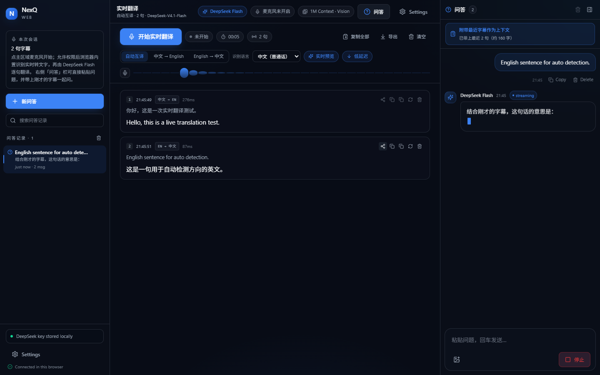
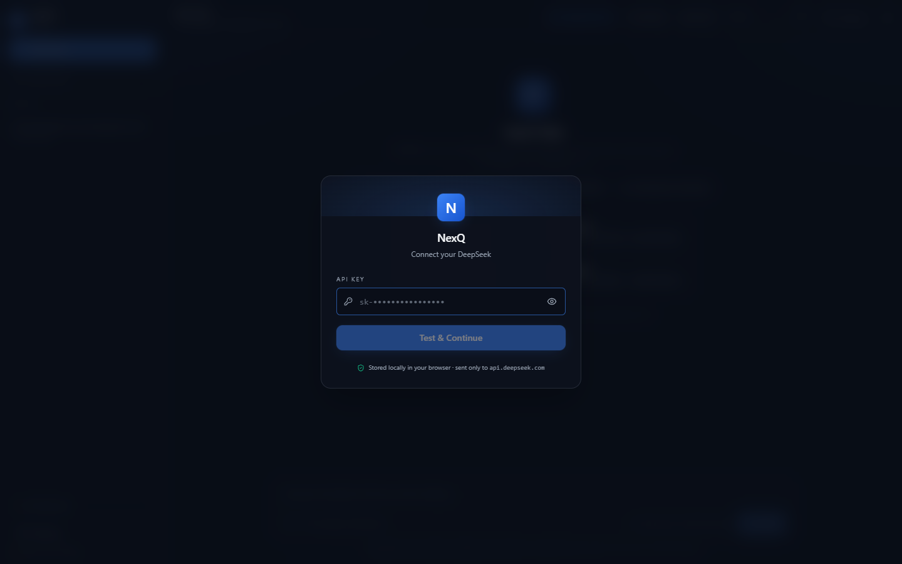

# NexQ Web

**100% 浏览器端的实时语音翻译 + DeepSeek 对话客户端。**
把 NexQ 的前端 UI/UX 保留下来，去掉全部桌面后端：没有 Tauri、没有 Rust、没有 Node 服务、没有 API Proxy、没有数据库。构建产物 `dist/` 是纯静态文件，直接丢到 GitHub Pages 就能用。

### 🚀 线上地址：**https://nakanonino455.github.io/nexq-web/**

[](https://github.com/NakanoNino455/nexq-web/actions/workflows/deploy.yml)



<details>
<summary>首次使用截图（API Key Modal）</summary>



</details>

两个界面：

| 界面 | 做什么 |
| --- | --- |
| **实时翻译** | 点「开始实时翻译」→ 浏览器请求麦克风权限 → 边说边出**双语字幕**（原文 + DeepSeek Flash 译文，逐句流式） |
| **对话** | DeepSeek Flash 流式聊天：图片理解、1M 上下文、Markdown、代码复制、Regenerate |

```
GitHub Pages → 浏览器打开网页 → 输入一次 DeepSeek API Key（存 localStorage）
             → 实时翻译（麦克风 → 识别 → DeepSeek 流式翻译 → 双语字幕）
             → 或对话（deepseek-flash 流式 · 图片理解 · 1M 上下文）
```

---

## 1. 快速开始

```bash
npm install
npm run dev      # 自动打开浏览器 → http://localhost:5173/nexq-web/
npm run build    # 产出 dist/（GitHub Pages 用）
npm run preview  # 本地预览 dist/
```

要求：Node.js 18+（开发用 20/22/24 均验证通过）。**不需要**安装任何桌面程序、Rust 工具链或后台服务。

### ⚠️ 不要直接双击 `index.html`

这是 Vite 的 ES Module 应用，浏览器在 `file://` 协议下会拒绝加载外部模块，双击只会看到一片空白：

```
Access to script at 'file:///C:/nexq-web/assets/index-xxx.js' from origin 'null'
has been blocked by CORS policy
```

三种正确打开方式：

| 方式 | 命令 / 操作 | 说明 |
| --- | --- | --- |
| **开发模式（推荐）** | `npm install` → `npm run dev` | 会自动打开浏览器；改代码即时热更新 |
| **本地预览产物** | `npm run build` → `npm run preview` | 跑真实 `dist/` 产物 |
| **单文件版（免安装、可双击）** | `npm run build:standalone` → 双击 `dist-standalone/nexq-web.html` | 一个 535KB 的自包含 HTML，CSS/JS/图标全部内联，双击即用，也可以直接发给别人 |

> 单文件版同样只访问 `https://api.deepseek.com`，Key 存在该页面的 localStorage 里。它只是额外的便利产物；`dist/` 仍是部署 GitHub Pages 的标准产物。

---

## 2. 它是什么 / 不是什么

| 保留（NexQ 前端资产） | 移除（NexQ 桌面部分） |
| --- | --- |
| 深色 slate 主题、HSL 设计令牌、`0.625rem` 圆角 | `src-tauri/`、Rust 后端、`@tauri-apps/*` 依赖 |
| 侧栏 / 对话区 / 输入区 / Settings 抽屉布局 | Tauri commands、IPC、`cpal`、WASAPI、原生麦克风采集 |
| 半透明毛玻璃、柔和辉光、5px 滚动条 | 桌面窗口 API、always-on-top、桌面悬浮层 overlay |
| 弹簧入场动画、Toast、流式 caret、shimmer | 系统托盘、原生通知、全局快捷键、原生截图 |
| Chat UI、Message Card、Markdown、代码块复制 | 原生文件系统 / 对话框 / Store / Updater 插件 |

`package.json` 里已经**没有**任何 `@tauri-apps/*`，项目里也**没有** `src-tauri/`。
`npm run dev` / `npm run build` 不会因为没有 Tauri 而报错。

---

## 3. 实时翻译（Live Translate）

### 怎么用

1. 打开页面（首次需先填一次 DeepSeek API Key）
2. 左侧切到 **实时翻译**，点 **开始实时翻译**（或空状态里的大麦克风）
3. 浏览器弹出**麦克风权限**请求 → 选「允许」
4. 开始说话：识别中的文字实时显示（灰色斜体），稳定后立刻流式给出**预览译文**
5. 一句话说完 → 变成一条**双语字幕**（上：原文，下：译文，右侧显示语向与耗时）
6. 可随时 **停止翻译**（释放麦克风）、**复制全部**、**导出 .txt**、**清空**；每条字幕还能单独重译/复制/删除

### 架构（为什么必须这样）

```
麦克风 ──▶ 浏览器内置语音识别（Web Speech API）──▶ 文字
                                                  │
                                                  ▼
                                   DeepSeek Flash 流式翻译（chat/completions）
                                                  │
                                                  ▼
                                        双语字幕（逐句流式渲染）
```

**DeepSeek 没有语音识别（ASR）接口** —— 官方 API 只接受文本与图片，不接受音频。
所以语音转文字必须由浏览器完成，DeepSeek 只负责把文字翻译好。

### 可切换的设置（界面顶部 + Settings → 实时翻译）

| 设置 | 说明 |
| --- | --- |
| 翻译方向 | **自动互译**（按每句话的语言自动决定中→英 / 英→中）/ 固定 中→英 / 固定 英→中 |
| 识别语言 | 中文（普通话）/ English (US) / 日本語 / 한국어（固定方向时自动跟随方向） |
| 实时预览 | 说话过程中就先流式给出预览译文（默认开） |
| 低延迟 | 翻译时关闭 DeepSeek 思考模式，首字更快（默认开） |
| 保留翻译记录 | 字幕存 `localStorage`，刷新后仍在（默认开） |

单句翻译带**上下文**：会把最近 4 组「原文 → 译文」一起发给模型，让人名、术语、代词保持一致。
翻译队列**严格串行**，一次只发一个请求，避免连续说话时触发限流或字幕乱序。
Chrome 会在停顿后自动结束识别，应用会自动重连（带退避与重试上限，不会死循环）。

### 支持范围与限制（请认真看）

| 项目 | 情况 |
| --- | --- |
| 浏览器 | **仅 Chrome / Edge**（桌面与 Android Chrome）。Firefox 与 Safari 未实现 Web Speech API，页面会直接提示 |
| 网络 | Chrome 的识别实现会把音频发到 **Google 的语音服务**，国内通常需要代理/VPN 才能识别；不通时页面会明确提示「Speech service unreachable」 |
| 权限 | 麦克风只在 **https://** 或 localhost 下可用（GitHub Pages 是 https，没问题）。被拒绝时会提示如何在地址栏重新允许 |
| 隐私 | 音频 → Google（浏览器实现）；**文字 → DeepSeek**；API Key 只在你本机 localStorage，仓库里没有也不会有 Key |
| 费用 | 每句话一次很小的 `chat/completions` 请求。按 Flash 价格（缓存未命中约 $0.15/1M 输入）算，正常说话量每天通常是**分级美分** |

快捷键：`Ctrl/Cmd + Shift + L` 切到实时翻译，`Ctrl/Cmd + Shift + O` 新对话，`Ctrl/Cmd + ,` 打开设置。

---

## 4. 功能对照

| 需求 | 实现位置 |
| --- | --- |
| 启动读取 `localStorage` → 无 Key 弹 API Key Modal | `src/App.tsx`（hydrate → gate）、`src/components/ApiKeyModal.tsx` |
| Key 存储键 `nexq_deepseek_api_key` | `src/lib/storage.ts` |
| Show / Hide Key | `ApiKeyModal` 的 `Eye / EyeOff` 切换 |
| `POST https://api.deepseek.com/chat/completions` | `src/lib/deepseek.ts`（唯一网络出口） |
| 模型固定 `deepseek-flash`（DeepSeek-V4.1-Flash） | `src/lib/constants.ts` |
| 1M Context（不设 4K/8K/32K/128K 上限） | 顶部实时用量表 + 完整 history 每轮全量发送 |
| `fetch()` + `ReadableStream` SSE 流式 | `src/lib/sse.ts` + `streamChat()` |
| 先显示 Thinking… 再逐段更新 | `MessageCard` + `ThinkingBlock`（读 `reasoning_content`） |
| Stop generating → `AbortController.abort()` | `Composer` 的 Stop 按钮 → `chatStore.stop()` |
| 图片：按钮 / 拖拽 / `Ctrl+V` 粘贴 | `src/lib/images.ts` + `Composer` |
| 支持 JPEG / PNG / GIF / WebP（按文件头识别） | `sniffImageMime()` |
| 图片预览条（可删除、可多张） | `src/components/ImageStrip.tsx` |
| 图片转 `data:image/...;base64,...` 发送 | `buildApiMessages()` → `image_url` block |
| 纯图片发送自动补提示词 | `DEFAULT_IMAGE_PROMPT`（"请详细分析这张图片…"） |
| 截图 = 系统截图 + `Ctrl+V`（无桌面截图 API） | `imageFilesFromClipboard()` |
| 多轮上下文（图片后续追问可见） | `buildApiMessages()` + `keepHistoryImages` |
| `+ New Chat` → `messages = []` | `Sidebar` → `chatStore.newChat()` |
| Regenerate / Copy | `MessageCard` 动作行 |
| Markdown / 代码块 + Copy | `src/components/Markdown.tsx` |
| Settings（API Key / Model / Context / Images） | `src/components/SettingsPanel.tsx`，**无 Provider 选择器** |
| 错误分类（401/402/429/5xx/网络/超时/解析/Abort） | `src/lib/errors.ts` |

---

## 5. 部署到 GitHub Pages

### 方式 A：GitHub Actions（推荐，已内置）

仓库 → **Settings → Pages → Build and deployment → Source: GitHub Actions**，然后 push 到 `main`。
`.github/workflows/deploy.yml` 会自动 `npm ci` → `npm run build` → 发布 `dist/`。

### 方式 B：手动

```bash
npm run build
# 把 dist/ 推到 gh-pages 分支，或在 Pages 里选择该目录
```

### base 路径

`vite.config.ts` **不会**把 base 写死成 `/`：

1. `VITE_BASE_PATH` 环境变量优先（用户主页仓库设为 `VITE_BASE_PATH=/`）；
2. 否则从 `GITHUB_REPOSITORY` 推导：`owner/nexq-web` → `/nexq-web/`，`owner/owner.github.io` → `/`；
3. 本地默认 `/nexq-web/`。

所以仓库名叫 `nexq-web` 时，产物引用的是 `/nexq-web/assets/...`，部署到
`https://<user>.github.io/nexq-web/` 可直接打开。

路由是单页应用（无 React Router、无服务端路由），刷新任何路径都会回落到 `index.html`。

---

## 6. DeepSeek API 约定

```http
POST https://api.deepseek.com/chat/completions
Content-Type: application/json
Authorization: Bearer <user key>

{ "model": "deepseek-flash", "messages": [...], "stream": true }
```

* 默认模型：`deepseek-flash`（对应 **DeepSeek-V4.1-Flash**）。不使用 `deepseek-chat`、`deepseek-reasoner`，也不使用旧名 `deepseek-v4-flash`。
* 上下文：**1M tokens**；输出上限 384K。历史消息全量发送，不做人为截断。
* 视觉：`content` 传数组，`{"type":"image_url","image_url":{"url":"data:image/png;base64,..."}}`；支持 JPEG/PNG/GIF/WebP，单图 ≤32MB，请求体 ≤48MB，图片只能出现在 `user` 消息里（assistant 消息里的图片会被丢弃并加文字占位）。
* 思考模式：默认开启，增量在 `delta.reasoning_content`；关闭时请求体带 `{"thinking":{"type":"disabled"}}`。
* 错误码：401 / 402 / 422 / 429 / 500 / 503，分别映射为具体文案。

浏览器**直连** DeepSeek，不经任何自建后端：

```
Browser ──fetch()──▶ https://api.deepseek.com
```

---

## 7. 数据与隐私

只使用 `localStorage`：

| Key | 内容 |
| --- | --- |
| `nexq_deepseek_api_key` | 用户自己的 DeepSeek Key |
| `nexq_settings` | 思考模式、系统提示词、Enter 发送、翻译方向与识别语言等偏好 |
| `nexq_chat_history` | 对话会话与消息（含图片 data URL） |
| `nexq_translate_transcript` | 实时翻译字幕记录（最近 200 句，可关闭保存） |

**音频不会被本应用保存或上传到任何服务器**：音量表只做本地实时分析，不录音；语音识别由浏览器内置能力处理（Chrome 会把音频交给 Google 的语音服务），发往 DeepSeek 的只有识别后的文字。

* 不使用 `.env` 存用户 Key，仓库里**没有任何** API Key，也不要提交任何 Key。
* 没有服务器 Secret、没有遥测、没有第三方脚本、没有 CDN 依赖（字体走系统栈，可离线运行）。
* Settings → Local data 可一键清除历史/字幕或抹除全部本地数据（抹除后重新回到 API Key Modal）。

---

## 8. 验收自测

| # | 测试 | 怎么做 | 期望 |
| --- | --- | --- | --- |
| 1 | 开发启动 | `npm run dev` | 自动打开浏览器到 `/nexq-web/`，无报错，出现 API Key Modal |
| 2 | 无 Key | DevTools → Application → Clear localStorage → 刷新 | 再次出现 API Key Modal |
| 3 | 真实 Key | 输入 `sk-...` → **Test & Continue** | 提示 `Connection successful` 并进入界面 |
| 4 | 对话流式 | 发送 `你好` | 先 `Thinking…`，随后逐段出现答案，带 streaming 标记 |
| 5 | 视觉 | 上传 PNG/JPG + `分析这张图片` | 正常返回图像分析 |
| 6 | 粘贴截图 | `Win + Shift + S` → `Ctrl + V` | 输入框上方出现缩略图预览 |
| 7 | 长对话 | 连续多轮追问 | 请求体包含全部历史（Network 面板可见 `messages` 数组） |
| 8 | 停止 | 生成中点 **Stop generating** | 立刻停止，标记 `stopped`，保留已生成内容 |
| 9 | 构建 | `npm run build` | `BUILD SUCCESS`，产出 `dist/` |
| 10 | **实时翻译-权限** | 切到实时翻译 → 点 **开始实时翻译** | 浏览器弹出麦克风权限请求；允许后状态变「正在聆听」 |
| 11 | **实时翻译-字幕** | 对着麦克风说话 | 识别文字实时出现，随后逐句出现译文（双语字幕） |
| 12 | **实时翻译-方向** | 先说中文，再说一句英文 | 中文出英文、英文出中文（自动互译），也可手动固定方向 |
| 13 | **实时翻译-停止** | 点 **停止翻译** | 立即停止识别，地址栏麦克风图标消失 |
| 14 | **实时翻译-导出** | 点 **复制全部** / **导出** | 剪贴板得到全文，或下载 `nexq-transcript-*.txt` |

> 测试 3–8、10–14 需要你自己的真实 DeepSeek API Key，测试 10–14 还需要 Chrome/Edge + 可用的麦克风。
> 仓库里不含 Key，我也没有替你写入任何 Key。

### 自动化端到端验证（可选，不需要真实 Key）

两个脚本都会在本机 Chrome 里跑**真实的 `dist/` 产物**，并通过 Chromium 的 host-resolver
规则把 `https://api.deepseek.com` 指向本地 TLS mock，因此流式、Abort、图片、多轮历史、
各类错误都能真实复现：

```bash
npm i -D playwright-core selfsigned   # 仅验证用，App 本身不依赖
npm run build
npm run verify:e2e                    # 对话：66 项断言
npm run verify:translate              # 实时翻译：36 项断言
```

截图会落到 `verification/artifacts/`。

对话套件覆盖：首启 Modal / Show-Hide / Test & Continue / 流式增量渲染 / Markdown 与代码复制 /
多轮 history 请求体 / `Ctrl+V` 粘贴 / 纯图片默认提示词与 `image_url` data URL /
Stop 真的 abort（服务端确认连接被取消）/ 401·402·429·500·网络错误文案 / Regenerate / New Chat /
Settings 无 Provider 选择器 / Thinking 开关真的写进请求体 / 刷新后持久化 /
清空 localStorage 回到 Modal / 产物中无 Tauri 痕迹。

实时翻译套件用**假麦克风 + 可编程的假语音识别器**（按真实 Chrome 的行为触发 interim/final/onend），
覆盖：麦克风授权 → 识别中文字实时显示 → 预览译文 → 整句变成双语字幕（含流式光标）→
语向自动判定（中→英 / 英→中）→ 上下文一起发送 → Chrome 自动结束识别后自动重连 →
单条重译 / 复制全部 / 导出 .txt / 清空 → 刷新后字幕仍在 → 402 错误显示在字幕条上 →
**拒绝麦克风权限时给出明确指引**。

也验证过：`dist-standalone/nexq-web.html` 用 `file://` 双击打开后可正常走完
「API Key Modal → Test & Continue → 流式回答 → 代码块复制」全流程（9/9 通过）。

---

## 9. 目录结构

```
src/
├── App.tsx                 # 启动流程：hydrate → 有 Key 进界面 / 无 Key 弹 Modal；对话 ⇄ 实时翻译
├── main.tsx                # React 挂载 + ErrorBoundary
├── index.css               # NexQ 设计令牌 / 动画 / markdown prose
├── components/
│   ├── ApiKeyModal.tsx     # 首次使用的 Key 弹窗（Test & Continue）
│   ├── Sidebar.tsx         # 左侧栏：模式切换 / New Chat / 会话列表 / Key 状态
│   ├── TopBar.tsx          # DeepSeek Flash · 1M Context · Vision · 麦克风状态
│   ├── TranslateView.tsx   # 实时翻译主界面（开始/停止、方向、语向、导出）
│   ├── SegmentCard.tsx     # 一条双语字幕（原文 + 流式译文 + 单条操作）
│   ├── MicMeter.tsx        # 麦克风电平表（滚动条柱）
│   ├── ChatView.tsx        # 消息列表 / 吸底滚动 / 空状态快捷操作
│   ├── MessageCard.tsx     # 用户与 AI 消息卡（Copy / Regenerate / 错误重试）
│   ├── ThinkingBlock.tsx   # reasoning_content 折叠块
│   ├── Markdown.tsx        # GFM + 代码高亮 + 代码块 Copy
│   ├── Composer.tsx        # 输入框 / 图片按钮 / 拖拽 / Ctrl+V / Stop
│   ├── ImageStrip.tsx      # 图片预览条（可删可多张）
│   ├── SettingsPanel.tsx   # 右侧设置抽屉（含实时翻译设置）
│   ├── Lightbox.tsx        # 图片放大查看
│   ├── Toaster.tsx         # NexQ 风格 Toast
│   └── ui/Button.tsx       # shadcn 风格按钮（cva + tailwind-merge）
├── lib/
│   ├── constants.ts        # 唯一外部 API、模型名、存储键、图片/翻译限制
│   ├── speech.ts           # Web Speech API 封装（自动重连、错误分类）
│   ├── mic.ts              # 麦克风权限 + 电平分析（不录音）
│   ├── translate.ts        # 语向判定 + 流式翻译（复用小请求核心）
│   ├── deepseek.ts         # 请求构造 + 流式 + Test Connection
│   ├── sse.ts              # 手写 SSE 解析（跨 chunk、[DONE]、多行 data）
│   ├── errors.ts           # 错误分类与用户文案
│   ├── images.ts           # 校验 / data URL / 剪贴板与拖拽提取
│   ├── storage.ts          # localStorage 读写与配额降级
│   └── tokens.ts           # 1M 上下文用量估算
├── stores/                 # zustand：chat / settings / toast / lightbox
└── types.ts
```

---

## 10. 常见问题

**Q: 浏览器直连 DeepSeek 会不会有 CORS 问题？**
A: 官方 `api.deepseek.com` 允许浏览器跨域调用，本应用就是按此设计（无需代理）。若你的网络环境或扩展拦截了请求，会看到 `Network Error` 文案，请检查网络、代理或广告拦截插件。

**Q: 为什么有时先显示一大段"思考"？**
A: Flash 默认开启 thinking 模式，思考内容通过 `reasoning_content` 单独返回。可在 Settings 里关闭 **Thinking mode** 或关闭 **Show reasoning**。

**Q: 历史记录会占空间吗？**
A: 会，图片以 base64 存在 `nexq_chat_history` 里。写入超出配额时会自动降级（丢弃旧图片数据）并提示你删除旧会话。

---

## 11. 许可

前端视觉与交互沿用 [naxhq/NexQ](https://github.com/naxhq/NexQ) 的设计语言；本仓库为纯 Web 重写版本，遵循上游 MIT 许可。
